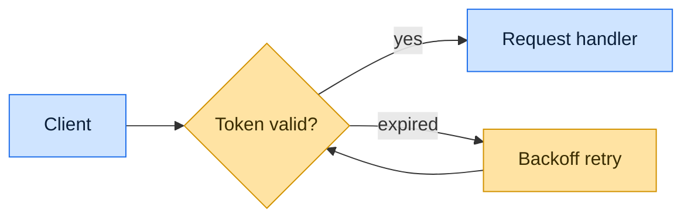

First run `git diff upstream/main...HEAD` to understand all changes being proposed. The title and description should communicate the value and reasoning behind the changes, not describe what the code does line-by-line.

## Title Format

Follow Commitizen conventions with 1-2 relevant emoji:

```
<emoji> <type>(<scope>): <short summary>
```

**Types**: feat, fix, docs, style, refactor, perf, test, build, ci, chore, revert

**Examples**:
- `✨ feat(auth): add OAuth2 support for third-party logins`
- `🐛 fix(api): resolve race condition in request handler`
- `♻️ refactor(core): simplify state management flow`

Keep titles under 72 characters. The emoji goes at the start, pick one that matches the change type.

## Description Format

Write in paragraphs, not bullet lists. Do not start with a header. Use 1-3 emoji sparingly throughout to highlight key points. Once the title and body are drafted, run them through the `no-slop` skill and apply its edits before creating or updating the PR.

**Structure**:

1. **Opening paragraph**: State the motivation. Why was this change needed? What problem does it solve? What's the user or developer benefit?

2. **Approach paragraph**: Explain how the solution works at a high level. Focus on the design decisions and trade-offs, not implementation details.

3. **Impact paragraph** (if applicable): Note any behavioral changes, migration steps, or things reviewers should pay attention to.

**Formatting**:
- Use backticks `` for quoting code, variables, file names, and technical terms (not double quotes "")
- Only state what the diff or a reference proves. Don't speculate about behavior, performance, or intent you can't back up
- When a reference exists (issue, ticket, design doc, spec, benchmark, prior PR or commit), weave the link into the sentence it supports rather than dumping it in a footer

**Avoid**:
- Mentioning tests or test coverage
- Describing what specific functions or methods do
- Adding yourself as co-author
- Starting with a header like "## Summary"
- Bullet-point lists of file changes
- Marketing or hype language, and any claim or assumption not grounded in the diff or a cited reference
- AI slop: filler phrases, throat-clearing openers, emphasis crutches, adverbs, vague declaratives, em dashes, passive voice, "not X but Y" contrasts, false agency (inanimate objects doing human verbs)

**Good example**:

```
Users signing in with Google accounts were redirected to an error page because
the session token expired before the OAuth callback completed. 🔐 This became
more frequent as our user base grew internationally, where network latency is
higher.

The fix extends the token validity window during the OAuth flow and adds a
retry mechanism for the callback handler. ✨ This approach preserves our
security model while accommodating real-world network conditions.

Existing sessions remain unaffected. The retry logic uses exponential backoff
to avoid hammering the auth provider.
```

## Diagrams

Include a mermaid diagram when it makes the change easier to grasp than prose alone — architecture, request/data flow, state transitions, or how components relate. Skip it for small or self-evident changes; never add one just to decorate.

Color the diagram so it is easy on the eye and stays legible in both GitHub light and dark themes. Don't rely on default theme colors — they wash out on one side. Set explicit fills with `classDef`, using soft mid-tone fills, a saturated stroke, and dark text (`color:#...`) so contrast holds on both white and dark backgrounds. Use a small palette (2-3 classes) to group node types; keep fills muted, not neon.



## Labels

Pick applicable labels from `enhancement`, `bug`, `documentation` based on the change type:

- `feat`, `perf`, `refactor`, `style` → `enhancement`
- `fix` → `bug`
- `docs` → `documentation`
- Multiple labels are fine if the PR spans categories

## Workflow

### Creating a new PR

1. Run `git diff upstream/main...HEAD` to see all changes
2. Run `git log upstream/main..HEAD --oneline` to see commit history
3. Identify the primary purpose (what user/developer problem this solves)
4. Draft title following Commitizen format with emoji
5. Write description paragraphs explaining why and how
6. Determine labels from the change type
7. Create with:

```bash
gh pr create --title "..." --body "..." --label "<labels>"
```

### Updating an existing PR

1. Run `git diff upstream/main...HEAD` to see all changes
2. Run `git log upstream/main..HEAD --oneline` to see commit history
3. Identify the primary purpose (what user/developer problem this solves)
4. Draft title following Commitizen format with emoji
5. Write description paragraphs explaining why and how
6. Determine labels from the change type
7. Update with `gh pr edit <number> --title "..." --body "..."` and add missing labels
